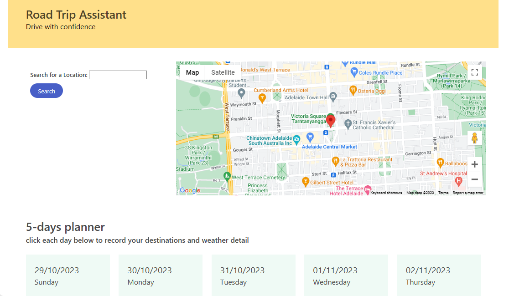

# Road Trip Assistant
## Description
- Road Trip Assistant is an app which allows users to plan for a road trip by searching locations for petrol prices and weather forecasts.
- Users can search the average petrol prices for any major town and city in Australia.
- Five-day weather forecasts are displayed for each location.
- The app also features a Google Maps window for other route and location info.
## Technologies Used
- Bulma CSS
- Widgets from fuelprice.io
- Google Maps API
- Weather information from https://api.openweathermap.org
## Screenshot

## Link
https://mkdkck.github.io/roadTripAssistant/
