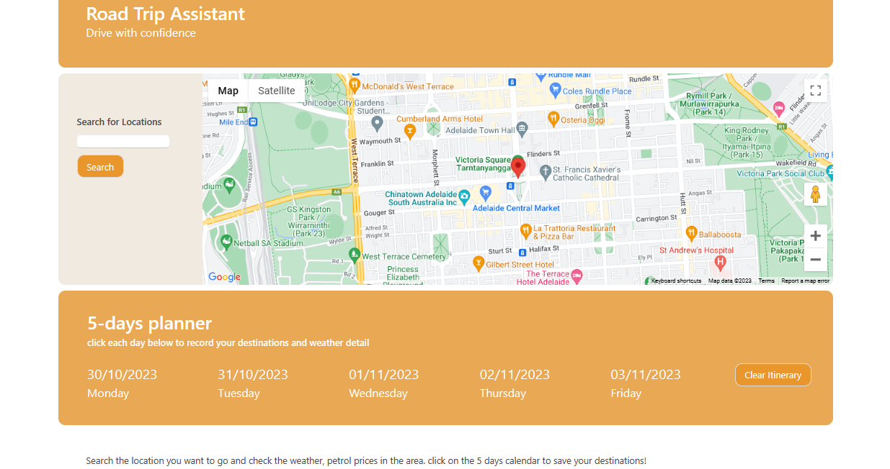

# Road Trip Assistant

## Description
- Road Trip Assistant is an app which allows users to plan for a road trip by searching locations for petrol prices and weather forecasts.
- Users can search the average petrol prices for any major town and city in Australia.
- Five-day weather forecasts are displayed for each location.
- The app also features a Google Maps window for other route and location info.
- Users can also save their destination info and then clear it for a different search.

## Technologies Used
- Bulma CSS, Javascript and HTML
- Widgets from fuelprice.io
- Google Maps API
- Weather information from https://api.openweathermap.org

## Function Explain
### search bar
- when search bar submitted, location typed in transferred to Geocode and provide to weather Api for info fetching.
- when a detail address is searched, google map shows the location, a function triggered to search the city of that location and pass it on to feul widget and card location.
- when a city is searched, google map shows the city, city name pass to feul widget and to the card location.
- when a vague location is searched (eg Phillip Island), a dialog pop up and shows the search need to be specified for fuel info, but the vague location will pass on to the planning card and weather shows accordingly.
- when a non location is searched, a warning section pop up to indicate the search is not valid.
### days planner
- when a valid location searched, weather info together with date will be listed on the 5 days planning cards.
- click onto any card to store the info, search again to show other days selections.
- use Clear Itinerary button to clear the saved data.

## Screenshot

## Link
https://mkdkck.github.io/roadTripAssistant/
